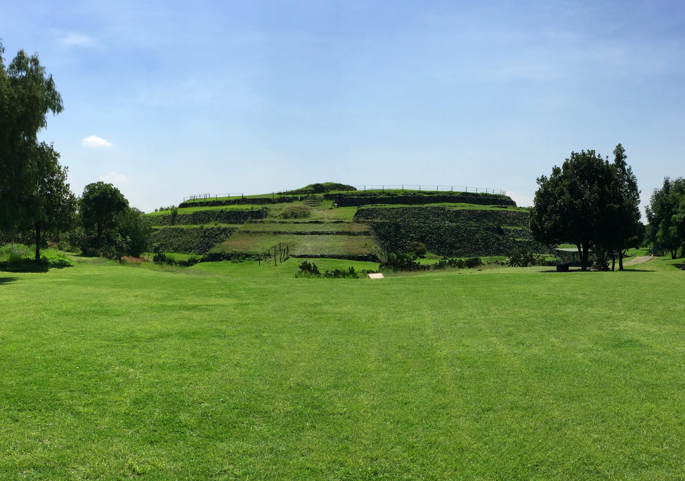

# Cuicuilco: A Framework for Hierarchical Processing

Cuicuilco is a Python framework that allows the construction, training, and evaluation of hierarchical networks (e.g., hierarchical compositions of learning algorithms), particularly *Hierarchical Slow Feature Analysis* (HSFA) networks, to solve regression and classification problems on images and other high-dimensional data. 

This framework was initially created to carry out most experiments of the PhD thesis entitled *Extensions of Hierarchical Slow Feature Analysis for Classification and Regression of High-Dimensional Data* by Alberto N. Escalante B. This PhD was carried out at the Institute for Neural Computation at the Ruhr University Bochum, Germany. Cuicuilco can be easily extended in the following ways: (1) By adding additional experiments that encapsulate new datasets, and (2) by including new hierarchical networks or learning algorithms. 


## Who should use Cuicuilco?
Cuicuilco is intended to be used by researchers/developers, who are interested in trying hierarchical networks for supervised learning based on (but not limited to) *Slow Feature Analysis* (SFA) on their particular datasets/problems. 

## News
* **6.2.2018** Cuicuilco now supports the latest version of MDP
* **3.2.2018** Compatibility with Python 2 and 3

## Dependencies
Cuicuilco requires the following libraries:
* [Modular Toolkit for Data Processing (MDP)](https://github.com/mdp-toolkit/mdp-toolkit)
* numpy
* scipy
* sklearn
* pillow (PIL)
* numexpr (optional)
* libsvm (optional)
* lockfile
* lxml

## How is Cuicuilco pronounced? and, why is it called like that?
The pronunciation of Cuicuilco is available in [this link](http://es.forvo.com/word/cuicuilco/) and sounds similar to `ku:i-{\bf ku:il}-ko'.
This name has been chosen in honor of the Cuicuilco pyramid (800 B.C.\ to 250 A.D.) located in the south of Mexico City. This pyramid is divided in a few stages, resembling hierarchical SFA networks to some extent.

 Image Copyright by [TJ DeGroat](https://www.flickr.com/photos/tjdegroat/18800899800/)  under the Creative Commons Attribution 2.0 Generic licence [(CC BY 2.0)](https://creativecommons.org/licenses/by/2.0/). The image has been cropped and digitally processed for display purposes (saturation and color level adjustments).


## Usage and further documentation
Assuming the code was donwloaded into the cuicuilco directory, the framework can be executed as follows **(the -m switch is crucial)**:
  > python -u -m cuicuilco.cuicuilco_run [OPTION1] [OPTION2] ...

Several command line options are accepted as well as additional parameters specified by environment variables (see the file 'set_environment_variables'). For details regarding these options and parameters, the inclusion of new experimental databases, and the creation of new hierarchical networks, **please consult Appendix A of the dissertation mentioned in the references below, which is the most extensive documentation of this framework currently**.

Elements of the code can be reused, particularly the new nodes:
```import cuicuilco
from cuicuilco.gsfa_node import GSFANode
from cuicuilco.igsfa_node import iGSFANode
from cuicuilco.more_nodes import BasicAdaptiveCutoffNode
```

## A single run of Cuicuilco
In rough terms, each run of Cuicuilco (cuicuilco_run) executes the following steps:
* File 'experimental_datasets.py' is imported and a list of all available datasets is extracted from it.
* File 'hierarchical_networks.py' is imported and a list of all available network descriptions is extracted from it.
* A particular network description and experimental dataset are selected. 
* If ELL is activated, an ELL graph is computed.
* The training data of the selected dataset is loaded from disk. 
* The network description is used to construct a concrete network (an MDP flow object). 
* The network is trained using a special purpose training method. Such a method has linear complexity w.r.t. the number of nodes in the network, provides the nodes with the training-graph information, and uses a node cache to reuse previously trained nodes. 
* Network post-processing operations take place (the sign of the top-node weights are adjusted, a final whitening node may be appended to the flow). 
* The supervised data is loaded from disk. 
* Features are extracted from the training data and supervised data using the trained network. 
* All enabled supervised steps are trained using the supervised data (the features extracted by the network and ground truth labels and classes). 
* The test data is loaded from disk.
* Features are extracted from test data using the trained network. 
* Label and class estimations are computed for the training, supervised, and test data.
* Error measures are computed (e.g., RMSE, MAE, classification rates). 
* If the graphical display is enabled, several plots are created to visualize the datasets and results.


## Author
Cuicuilco was originally developed by Alberto N. Escalante B. (alberto.escalante@ini.rub.de) as part of his PhD project at the Institute for Neural Computation, Ruhr-University Bochum, Germany, under the supervision of Prof. Dr. Laurenz Wiskott.

## References
* [Escalante-B, "Extensions of Hierarchical Slow Feature Analysis for Classification and Regression of High-Dimensional Data", PhD thesis, 2017](https://www.ini.rub.de/upload/file/1504713481_43023be2075d6a483471/Escalante-2017-PhD-Thesis.pdf)
* [Escalante-B, Wiskott, "How to Solve Classification and Regression Problems on High-Dimensional Data with a Supervised Extension of Slow Feature Analysis", Journal of Machine Learning Research 14:3683-3719, 2013](http://www.jmlr.org/papers/volume14/escalante13a/escalante13a.pdf)
* Escalante-B, Wiskott, "Improved graph-based SFA: Information preservation complements the slowness principle" (submitted to Machine Learning Journal)

## LICENSE
Licensed under the Apache License, Version 2.0: [http://www.apache.org/licenses/LICENSE-2.0](http://www.apache.org/licenses/LICENSE-2.0)

## Other information
Cuicuilco is being improved continuously, thus make sure to use the latest version.

Bugs/Suggestions/Comments/Questions: please send them to alberto.escalante@ini.rub.de or via github.
I will be glad to help you.
